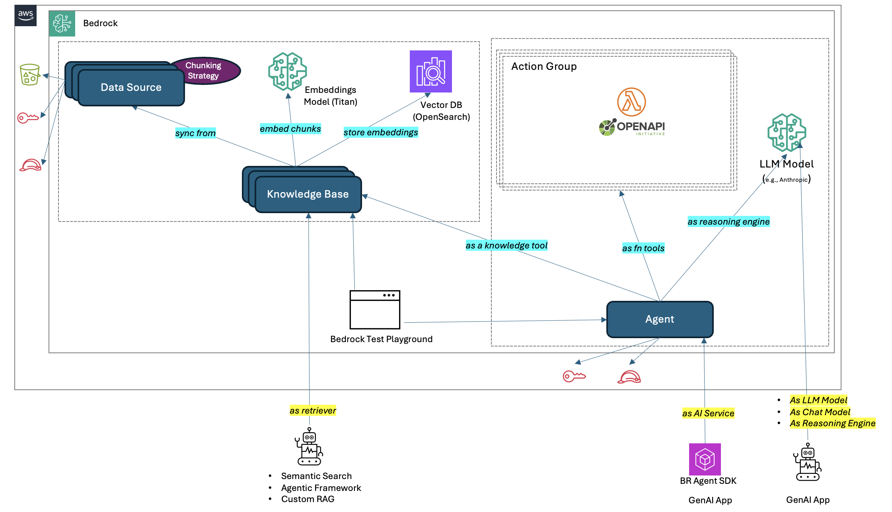

###

This is a supporting code repo for AWS Bedrock blog post :
https://kapil-raina.medium.com/aws-bedrock-exploring-agents-knowledge-base-rag-bd2856c80d2f

####
Reference
[Agents Lambda](https://docs.aws.amazon.com/bedrock/latest/userguide/agents-lambda.html)
[boto3 AgentsforBedrockRuntime](https://boto3.amazonaws.com/v1/documentation/api/latest/reference/services/bedrock-agent-runtime.html)
[boto3 invoke_agent](https://boto3.amazonaws.com/v1/documentation/api/latest/reference/services/bedrock-agent-runtime/client/invoke_agent.html)